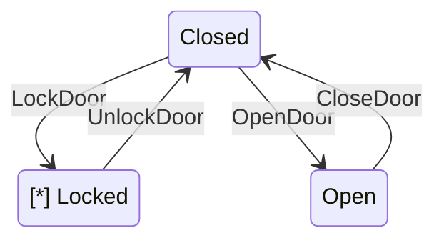

# zstate: Type-Safe State Machine Library for Go

[](https://goreportcard.com/report/github.com/upamune/zstate)
[](https://godoc.org/github.com/upamune/zstate)
[](https://opensource.org/licenses/MIT)
[](https://codecov.io/github/upamune/zstate)

zstate is a simple and type-safe state machine library for Go. It allows you to manage complex state transitions and clearly express business logic.

## Features

- 🔒 **Type-Safe**: Leverages generics for compile-time type checking
- 🛠 **Flexible**: Control transitions with custom guard functions
- 🧩 **Simple API**: Easy to use with an intuitive builder pattern
- 📦 **No Dependencies**: Uses only the standard library
- 🎨 **Visualization**: Generate state machine diagrams for documentation and debugging

## Installation

```bash
go get -u github.com/upamune/zstate
```

## Usage Example

Here's a simple example of a state machine managing a door's state:

```go
package main

import (
    "context"
    "fmt"
    "github.com/upamune/zstate"
)

type DoorState int

const (
	Closed DoorState = iota
	Open
	Locked
)

type DoorEvent string

const (
	OpenDoor  DoorEvent = "OpenDoor"
	CloseDoor DoorEvent = "CloseDoor"
	LockDoor  DoorEvent = "LockDoor"
	UnlockDoor DoorEvent = "UnlockDoor"
)

func main() {
	doorBuilder := zstate.NewStateMachineBuilder[DoorState, DoorEvent]()
	door, _ := doorBuilder.
		AddState(Closed).
		AddState(Open).
		AddState(Locked).
		AddTransition(Closed, Open, OpenDoor,
			zstate.WithBefore[DoorState, DoorEvent](func(ctx context.Context, from, to DoorState, event DoorEvent) {
				fmt.Println("Before opening the door")
			}),
			zstate.WithAfter[DoorState, DoorEvent](func(ctx context.Context, from, to DoorState, event DoorEvent) {
				fmt.Println("After opening the door")
			}),
		).
		AddTransition(Open, Closed, CloseDoor).
		AddTransition(Closed, Locked, LockDoor, zstate.WithGuard[DoorState, DoorEvent](func(ctx context.Context, from, to DoorState, event DoorEvent) bool {
			// Some condition to allow locking
			return true
		})).
		AddTransition(Locked, Closed, UnlockDoor).
		Build()

	ctx := context.Background()

	newState, err := door.Trigger(ctx, Closed, OpenDoor)
	if err != nil {
		fmt.Printf("Error: %v\n", err)
		return
	}
	fmt.Printf("New state: %v\n", newState)
}
```

## Error Handling

zstate provides custom error types for more precise error handling:

```go
newState, err := sm.Trigger(ctx, currentState, event)
if err != nil {
    var noTransitionErr *zstate.NoTransitionError[DoorState, DoorEvent]
    var guardErr *zstate.GuardError[DoorState, DoorEvent]

    if errors.As(err, &noTransitionErr) {
        fmt.Printf("No transition found: %v\n", noTransitionErr)
    } else if errors.As(err, &guardErr) {
        fmt.Printf("Guard condition not met: %v\n", guardErr)
    } else {
        fmt.Printf("Unexpected error: %v\n", err)
    }
    return
}

```

## Visualization

zstate provides a function to generate state machine diagrams:

```go
diagram, err := zstate.GenerateDiagram(sm, zstate.MermaidFormat, currentState)
if err != nil {
    fmt.Printf("Error generating diagram: %v\n", err)
    return
}
fmt.Println(diagram)
```




This function supports two formats:
- `MermaidFormat`: Generates a Mermaid.js compatible diagram
- `DOTFormat`: Generates a DOT language diagram

The current state is highlighted in the generated diagram, making it easy to visualize the state machine's current status.

## Documentation

For detailed documentation, please visit [GoDoc](https://godoc.org/github.com/upamune/zstate).

## Contributing

Pull requests are welcome. For major changes, please open an issue first to discuss what you would like to change.

## License

This project is licensed under the MIT License. See the [LICENSE](LICENSE) file for details.

## Support

If you have any questions or feedback, please open an issue on [GitHub Issues](https://github.com/upamune/zstate/issues).

---

Made with ❤️ by [upamune](https://github.com/upamune)